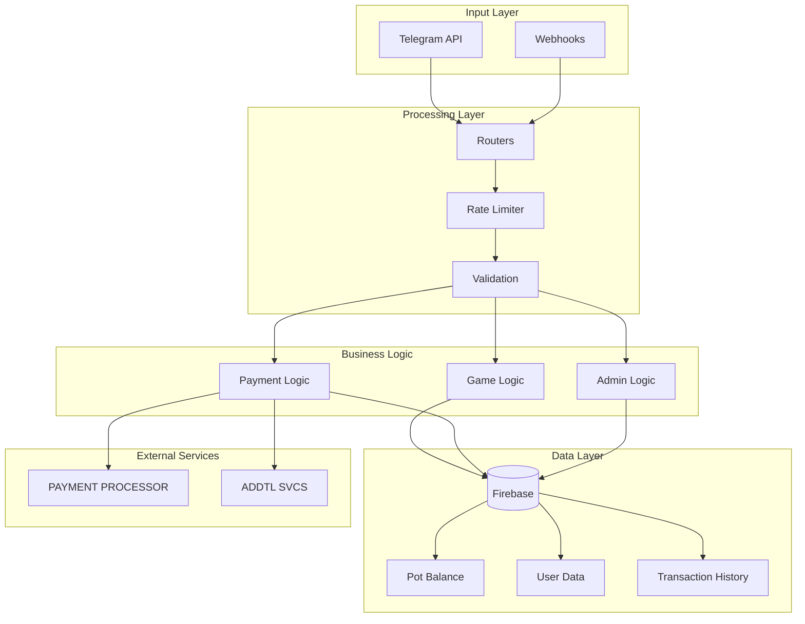

### A Telegram bot with casino game mechanics & crypto integration. 
> Intended to showcase the general architecture and game logic without providing explicit implementation instructions. This demonstration is intended for educational purposes only. It is in no way intended to promote or facilitate gambling platforms or services.
 This is a redacted summary, please contact for further details about the complete project.


## Example Data Flow




## Features 

- **Game Mechanics**: Basic dice betting and card game logic
- **User Interface**: Telegram bot command structure and inline keyboards
- **Database Operations**: User balance tracking and game state management
- **Rate Limiting**: Anti-abuse protection patterns
- **Admin Controls**: Basic administrative function structure
- **Architecture**: Modular design with separated concerns

## Demo Structure

```
src/
├── main.py              # Bot initialization (entry point patterns)
├── handlers.py          # Command routing examples
├── dice_game.py         # Simple probability-based game logic
├── blackjack_game.py    # Card game state management demo
├── database.py          # Data persistence patterns
├── rate_limiter.py      # Request throttling examples
└── admin_handlers.py    # Administrative function structure
```

## Key Concepts Illustrated

### 1. Game Logic Framework
- Probability calculations for fair gameplay
- Game state persistence across sessions
- Win/loss condition handling
- Balance validation before game actions

### 2. Bot Architecture
- Command handler registration and routing
- Inline keyboard navigation systems
- User session management patterns
- Error handling and logging strategies

### 3. Security Patterns
- Input validation and sanitization
- Rate limiting implementation
- Admin privilege verification
- Database query parameterization

### 4. User Experience
- Progressive disclosure of game options
- Clear feedback for user actions
- Help system and command documentation
- Statistics tracking and display

## Technical Implementation Notes

### Database Schema Concepts
```
users/
├── {user_id}/
│   ├── balance: decimal
│   ├── stats: object
│   └── permissions: object

games/
├── {game_id}/
│   ├── type: string
│   ├── state: object
│   └── players: array
```

### Command Structure Examples
- `/start` - Bot initialization and welcome
- `/balance` - User balance display
- `/bet <amount>` - Game betting interface
- `/stats` - Player statistics view
- `/help` - Command documentation

### Game Flow Patterns
1. User initiates game command
2. System validates user eligibility
3. Balance verification and reservation
4. Game logic execution
5. Result calculation and balance update
6. Statistics logging and user notification

## Security Considerations

This demo illustrates several security patterns:
- **Input Validation**: All user inputs are validated before processing
- **Rate Limiting**: Prevents spam and abuse through request throttling
- **Balance Protection**: Atomic operations prevent race conditions
- **Admin Verification**: Administrative functions require proper authentication

## Educational Purpose


## Development Insights

### Code Organization
The modular structure separates concerns effectively:
- Game logic isolated from bot framework
- Database operations abstracted into managers
- Handler functions keep business logic separate from routing
- Configuration management centralized

### Testing Approach
- Unit tests for game logic probability calculations
- Integration tests for database operations
- Mock external services for reliable testing
- Automated validation of bot command responses
